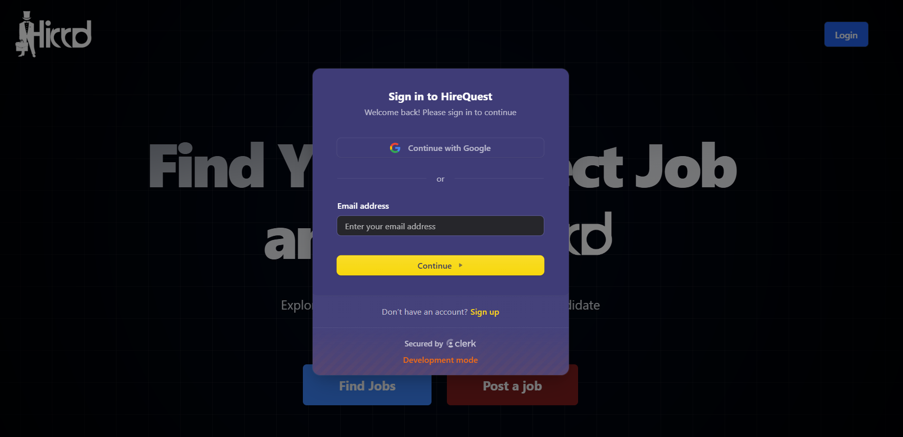
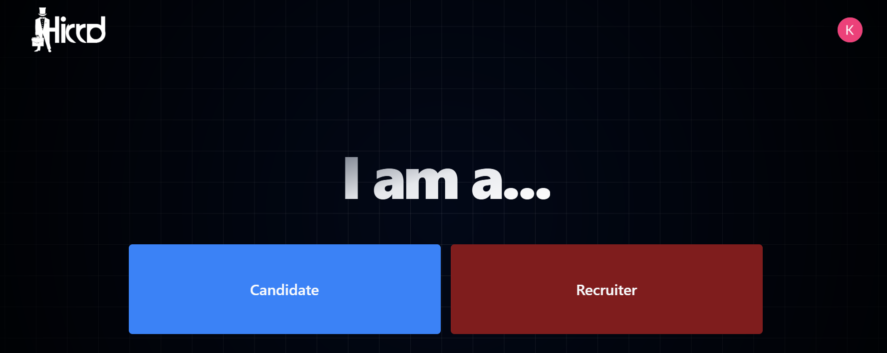
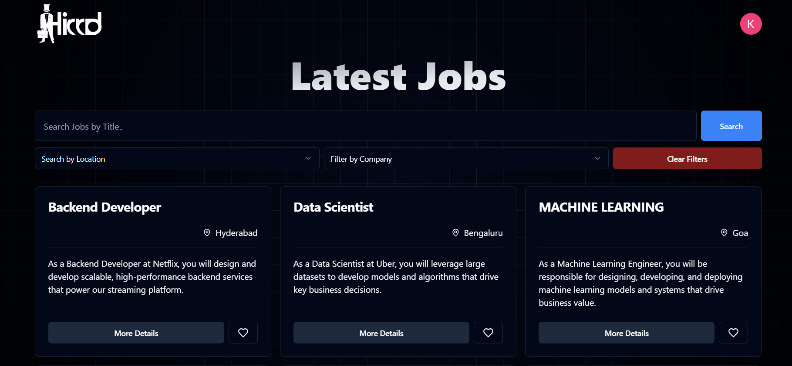
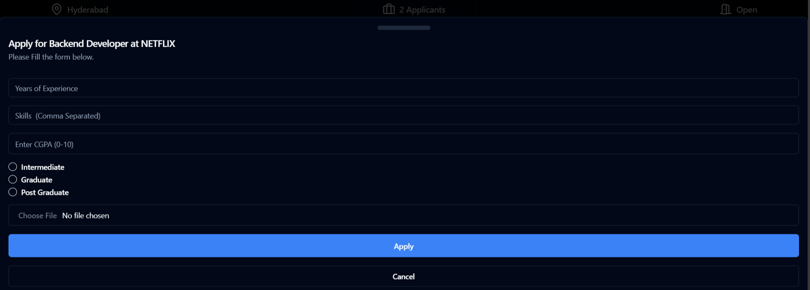
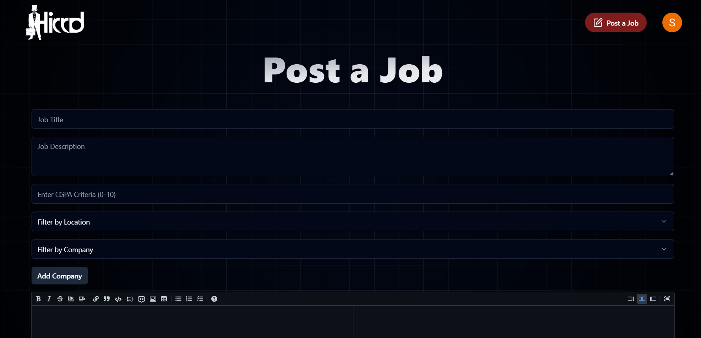

# Hirrd-Quest

---
 
## Problem Statement
  
In older recruitment systems, candidates often struggle to find job opportunities that match their academic eligibility and preferences, while recruiters face difficulty shortlisting suitable applicants from a large pool.  
Existing platforms lack intelligent filtering, secure authentication, and real-time interaction, leading to inefficient hiring and reduced engagement.

Hirrd-Quest addresses this gap by providing a secure, authenticated, and structured job recruitment platform that improves job–candidate matching and streamlines the hiring process.

---

## Hirrd-Quest

Hirrd-Quest is a full-stack job recruitment platform that allows candidates to explore relevant job opportunities based on CGPA, location, and company preferences.  
Recruiters can post jobs, shortlist candidates efficiently, and communicate directly with applicants.

The platform enforces secure and verified authentication using Google OAuth and Clerk Authentication to prevent fake or unauthorized access.

---

## Description

Hirrd-Quest is built using **React.js, Express.js, Supabase, and Tailwind CSS**.  
It follows a scalable full-stack architecture and implements **RESTful APIs** with secure authentication and role-based access.

Candidates can browse jobs, apply based on eligibility, and interact with recruiters through real-time messaging.  
Recruiters can manage job postings, filter applicants efficiently, and communicate directly with candidates, improving the overall hiring experience.

---

## Live Project

- 🌐 **Live Website:** [Hirrd-Quest Live](https://hirrd-quest-1.vercel.app/)
- 💻 **GitHub Repository:** [Hirrd-Quest GitHub](https://github.com/Naveen2320/hirrd-quest)

---

## Project Walkthrough

---

### Landing Page

The landing page introduces **Hirrd-Quest** with a modern and minimal UI.  
Users can explore the platform, find job opportunities, or post jobs.  
Clear call-to-action buttons guide candidates to search for jobs and recruiters to post openings.

---

### Authentication (Google OAuth & Clerk)

Users securely authenticate using **Google OAuth powered by Clerk Authentication**.  
This ensures **verified access**, prevents fake accounts, and provides a seamless login experience.

---

### Role Selection (Candidate / Recruiter)

After authentication, users select their role as either:
- **Candidate** – to apply for jobs  
- **Recruiter** – to post and manage job listings  

This enables **role-based access control** across the platform.

---

### Job Listings & Search

Candidates can browse the **latest job openings** with:
- Search by job title  
- Filter by location  
- Filter by company  

This helps users quickly find relevant job opportunities.

---

### Job Application Form

Candidates can apply for jobs by submitting:
- Years of experience  
- Skills  
- CGPA  
- Education level  
- Resume upload  

The structured form ensures **standardized and fair evaluation** by recruiters.

---

### Recruiter – Post a Job

- Post jobs with role details and CGPA eligibility  
- Filter candidates by location and company  
- Secure recruiter-only access for job posting  

---

## Major Features

### 1. Google OAuth Authentication
**Description:** Secure login using Google OAuth via Clerk Authentication.  
**Why Added:** Prevents fake users and ensures verified access.  
**Tech Stack:**  
- Clerk Authentication  
- Google OAuth 2.0  

---

### 2. Role-Based Access Control
**Description:** Separate dashboards and permissions for candidates and recruiters.  
**Why Added:** Ensures secure actions like job posting and job applications.  
**Tech Stack:**  
- Supabase  
- Express.js  

---

### 3. Job Search & Filtering System
**Description:** Candidates can search and filter jobs by CGPA, location, and company.  
**Why Added:** Improves job relevance and reduces search time significantly.  
**Tech Stack:**  
- React.js  
- Supabase  

---

### 4. Job Posting System (Recruiter)
**Description:** Recruiters can post jobs with eligibility criteria and requirements.  
**Why Added:** Streamlines hiring and reduces unqualified applications.  
**Tech Stack:**  
- React.js  
- Express.js  

---

### 5. Job Application System
**Description:** Candidates can apply by submitting experience, skills, CGPA, and resume details.  
**Why Added:** Enables structured and fair candidate evaluation.  
**Tech Stack:**  
- React.js  
- Express.js  
- Supabase  

---

## Challenges & Solutions

### Unauthorized Access
**Challenge:** Preventing candidates from accessing recruiter-only features.  
**Solution:** Implemented role validation before every protected action.

### Backend Data Handling
**Challenge:** Empty request body while submitting forms.  
**Solution:** Added `express.json()` middleware to parse incoming JSON data.

### Secure Authentication
**Challenge:** Avoiding fake accounts and unauthorized access.  
**Solution:** Integrated Google OAuth with Clerk Authentication.

---

## Technologies Used

- **React.js** – Frontend UI  
- **Tailwind CSS** – Responsive styling  
- **Express.js** – Backend framework  
- **Supabase** – Database & role management  
- **Clerk Authentication** – Secure authentication  
- **Google OAuth 2.0** – Verified login system  

---

## Architecture

- Client–Server Architecture  
- RESTful APIs  
- Role-Based Access Control  
- Secure Authentication Flow  

---

## Future Enhancements

- AI-based job recommendations  
- Recruiter analytics dashboard  
- Resume parsing and skill matching  
- Email notifications for job updates  

---

## Feedback / Bugs / Contributions

📧 Email: naveenkumar6885268@gmail.com

---

## License

This project is developed for educational purposes only and is not intended for commercial use.

---

  Created with ❤️ by  
  <strong>Naveen Kumar</strong>  
  Full Stack Developer | MERN | DSA | Cybersecurity Enthusiast

